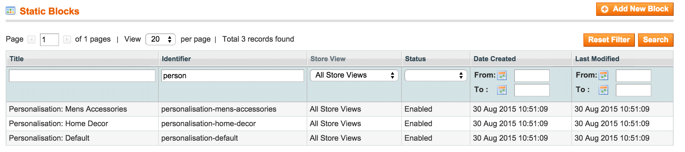
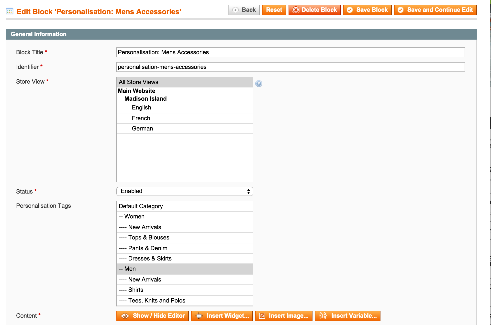
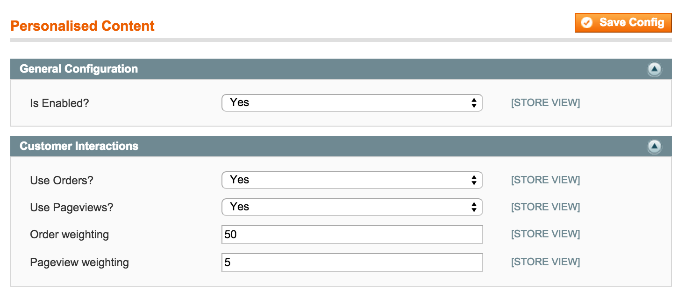

Meanbee PersonalisedContent Extension
=====================

Automatically show customers the most relevant static blocks based on their previous product purchases and views.

Description
-----------

Personalised product recommendations are popular but less effort has been put into customising CMS content based on customers preferences.  This module provides a widget which will determine the most appropriate static block to show to the customer based on their purchase history.  Static blocks are assigned product categories in order to understand their content. 
 
Customers' category preferences are determined by number of products purchased and viewed in each category.   
 
### Static Blocks
 
Multiple static blocks

 
Each one can have categories assigned to them for use in personalisation.

 
### Configuration

This extension can be customised to choose which customer interactions affect personalisation and a weighting for how much.  The current version looks for orders and pageviews for products.
 

### Logged in as Ash

### Logged in as Tom

Technical Overview
------------------

Static blocks have a new attribute "Personalisation Tags" which is populated with the catalogue categories. 

There is a cron that runs at midnight each day which reindexes customers category preferences:

* If a customer has placed an order for a product, start tracking a score for the category that products is in.
* If a product is in multiple categories, split the score between categories.

To place content, insert the Meanbee PersonalisedContent widget.  When rendered, this will consider the current logged 
in customer and look for their favourite categories.  These can then be used to find a relevant static block to show. 

Demo Theme
----------

There is a demo theme available in the seperate [Meanbee_PersonalisedContentTheme](https://github.com/MageHack/PersonalisedContentTheme)
. It contains dummy images, styles, customers and order.

Support
-------
If you have any issues with this extension, open an issue on [GitHub](https://github.com/meanbee/Meanbee_PersonalisedContent/issues).

Contribution
------------
Any contribution is highly appreciated. The best way to contribute code is to open a [pull request on GitHub](https://help.github.com/articles/using-pull-requests).

Project Team
---------

* [Ash Smith](https://twitter.com/ashsmithco)
* [Tom Robertshaw](https://twitter.com/bobbyshaw)
* [Doug Ogisi](https://www.linkedin.com/pub/douglas-ogisi/1b/964/35b)
* [Shari Robertshaw](https://twitter.com/sharibary)

Licence
-------
[OSL - Open Software Licence 3.0](http://opensource.org/licenses/osl-3.0.php)

Copyright
---------
(c) 2015 Meanbee
